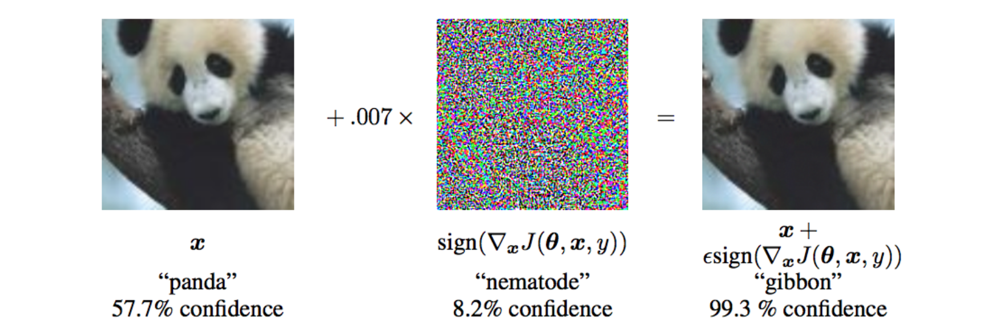

# ビッグデータアナリティクス 課題 "Adversarial Attack"
## 概要

統計的機械学習や深層学習の技術は、ビジネスの現場でも盛んに活用されはじめてきています。実用的なシステムとして利用するには、学習モデルのテストデータにおける精度のみならず、頑健性や意図しない外れ値などへの対応、長期的な運用における精度の維持など、様々な側面からモデルを評価し構成していく必要があります。
そうした機械学習モデルの頑健性を考える上で、特に深層学習で有名な例は[Goodfellow et al. (2014)](https://arxiv.org/abs/1412.6572)によるAdversarial Exampleでしょう。以下の図にあるように、パンダの画像に少しのノイズを載せることにより、人間が見ればパンダの画像であると明らかに識別できる画像において、分類器が誤認識する画像を生成することに成功しています。


([Goodfellow et al. (2014)](https://arxiv.org/abs/1412.6572)より引用)

このような取り組みは、NIPSにおいても["NIPS 2017: Non-targeted Adversarial Attack"](https://www.kaggle.com/c/nips-2017-non-targeted-adversarial-attack)のコンペティションとして出題されるなど、注目は高まりつつあります。

今回は、自然言語処理における分類問題に対してAdversarial Exampleを作成し、予測モデルの性質やその頑健性について考察してもらいます。Adversarial Attackという概念を通じて、機械学習の知識や、今後ますます役割が増えていくであろう機械学習を用いたWeb API利用、そしてそれを破るAdversarial Attackやその防御法について考えていくきっかけとなればと思います。

なお、今回の課題は研究ではないので、論文で発表されている手法や厳密なアルゴリズムにこだわる必要はありません。人力で泥臭く試行を繰り返してもらってもいいですし、普段取り組まないような課題に対して思考を巡らせて取り組んでみてください。

## 課題
### 課題1: データセットを探す

自然言語処理における二値/多値の分類問題として利用するデータセットを決めてください。研究用に公開されているものや、自身でクロールしたものなど、どのようなデータセットでも構いません。

ただし、データセットは下記の条件を満たすものとしてください。

- 日本語でも英語でも可（解釈のしやすさから日本語の方が良い）
- データ行数はヘッダー行含め100行以上1万行以内
- 各レコードのテキスト文字数は1000文字以内かつ500単語以内

#### データ形式の例
データセットの形式は任意ですが、課題3で用いるデータ形式は以下のような形で1行目にヘッダー、2行目以下にlabelとtextが書かれたデータを用います。ここでは例として[Getting Real about Fake News | Kaggle](https://www.kaggle.com/mrisdal/fake-news)のデータセットを用いて、ニュースタイトルとそれがフェイクニュースかどうかを判別するためのデータセットを例示しています。

```
label,text
not_spam,Muslims BUSTED: They Stole Millions In Gov’t Benefits
not_spam,Re: Why Did Attorney General Loretta Lynch Plead The Fifth?
not_spam,BREAKING: Weiner Cooperating With FBI On Hillary Email Investigation
spam,FANTASTIC! TRUMPS 7 POINT PLAN To Reform Healthcare Begins With A Bombshell! » 100percentfedUp.com
[...]
```
(https://www.kaggle.com/mrisdal/fake-news/data より)

#### 用いるデータの例

- [青空文庫　Aozora Bunko](http://www.aozora.gr.jp/)における著者推定
  - [青空文庫作家別一括ダウンロード](http://keison.sakura.ne.jp/)
- [livedoor ニュースコーパス](https://www.rondhuit.com/download.html#ldcc)の掲載メディア推定
- [言語処理100本ノック 2015](http://www.cl.ecei.tohoku.ac.jp/nlp100/) 8章で利用している[sentence polarity dataset v1.0](http://www.cs.cornell.edu/people/pabo/movie-review-data/rt-polaritydata.README.1.0.txt)の極性分析
- [Home Page for 20 Newsgroups Data Set](http://qwone.com/~jason/20Newsgroups/)における記事のニュースグループ推定

### 課題2: ローカルで分類器を作成する

課題1で用意したデータセットを用いて、スクラッチで分類器を作成してください。手法やプログラミング言語、利用パッケージはどのようなものでも構いません。

なお、ここで作成する分類器は利用するデータセットを80:20に分割した上で、テストデータでの分類精度において正確度(Accuracy)が75%を超えるようなものを作成してください。どうしても精度が出ない場合は、「課題1 データセットを探す」に戻って別のデータセットを準備してください。

- 参考
  - [Working With Text Data — scikit-learn 0.19.1 documentation](http://scikit-learn.org/stable/tutorial/text_analytics/working_with_text_data.html)
  - [テキスト分類問題その１ チュートリアル｜ビッグデータ大学（β）](http://universityofbigdata.net/competition/tutorial/5681717746597888)

### 課題3: A3RT Classification APIで分類器を作成する

課題1で用意したデータセットを用いて、[A3RT Classification API](https://a3rt.recruit-tech.co.jp/product/textClassificationAPI/)を使って分類器を作成してください。作成方法は公式のドキュメントおよび[参考資料](doc/A3RT_Usage.pdf)を参考にしてください。
また、作成したAPIに対して、幾つかのリクエストを送付して、分類器がある程度正しく動作しているかを確認してください。

### 課題4: ローカルの分類器で騙せる例を探す

独自に作成した分類器において、人間および分類器が正しく判定できる入力文と、その入力文に小さな操作を加えることで分類器のみが誤判定するような入力文の2つを作成してください。小さな操作は、下記のような方法などを試してみて下さい。

- 特定の単語を取り除く
- 特定の単語を入れ替える
- 関係の無い単語や文章を追加する
- 単語内に不要なスペースや記号を挿入する

また、作成した入力文に対して分類器がなぜ誤判定したかを考察してください。

#### 例

ニュース記事が「スポーツ」か「政治」かを分類する二値分類器を作成したとします。このモデルでは、下記のような入力に対して正しく分類できているとします。

- 入力文「阪神が優勝」 → 予測結果：スポーツ95%・政治5%
- 入力文「安倍首相が会見」 → 予測結果：スポーツ15%・政治85%

このとき、**「安倍首相が阪神優勝に関してコメント」** では、予測モデルはどういう予測結果を示すでしょうか？人間が見れば明らかに「スポーツ」の文章だとわかりますが、もしかしたら作成した二値分類器は「スポーツ35%・政治65%」といったように政治だと判断するかもしれません。
そうしたような、人間では間違えないが機械なら誤判定してしまうような入力文を考えてみて下さい。


### 課題5: A3RT Classification APIで騙せるような例を探す

同様に、A3RTで作成した分類器において、人間および分類器が正しく判定できる入力文と、その入力文に小さな操作を加えることで分類器のみが誤判定するような入力文の2つを作成してください。

また、作成した入力文に対して分類器がなぜ誤判定したかを考察してください。


### 課題6: 考察

課題1から課題5までの結果を踏まえて、各課題の取組内容のまとめと、全体を通してAdversarial Exampleの作成に関して成功/失敗に関わらず検討した手法を自由にまとめて下さい（スライド数枚程度）。

また、あなたが作成した分類器が例えばビジネスの現場で活用された際のリスクやその対策方法について自由に考察してください（スライド1枚程度）。

### 課題7: Adversarial Exampleの自動生成(発展課題・任意)

ローカルで作成した分類器に対して、指定した入力文から自動でAdversarial Exampleを作成するような方法/アルゴリズムを考えて下さい。それを実装の上、幾つかの入力文に対してAdversarial Exampleを自動作成し、アルゴリズムの妥当性や評価を行って下さい。

アイデア：同義語や語彙平易化、単語ベクトル、Variational Autoencoder

## 注意点

今回はA3RTのWeb APIを利用しますが、過度なリクエスト送信をしないように注意してください。幾つかの入力文をプログラムから送信して検証する際も、sleep等を入れて短時間にリクエストを集中させないような処理を入れて下さい。

## 質問

課題に取り組むにあたって不明な点や質問があれば、本レポジトリのissueに投稿してください。その際、学生番号や氏名など個人情報にあたるテキストは入力しないでください。

## 作成者

yuki_okuda <yuki_okuda@r.recruit.co.jp>
